# 红米 AX6000 最强 CPU 的硬路由(安装ShellClash)
[原参考链接](https://qust.me/post/ax6000-shellclash/)
## 链接路由器
一般链接新的路由器就会弹出[http://miwifi.com/init.html#/home](http://miwifi.com/init.html#/home)

###### 注意

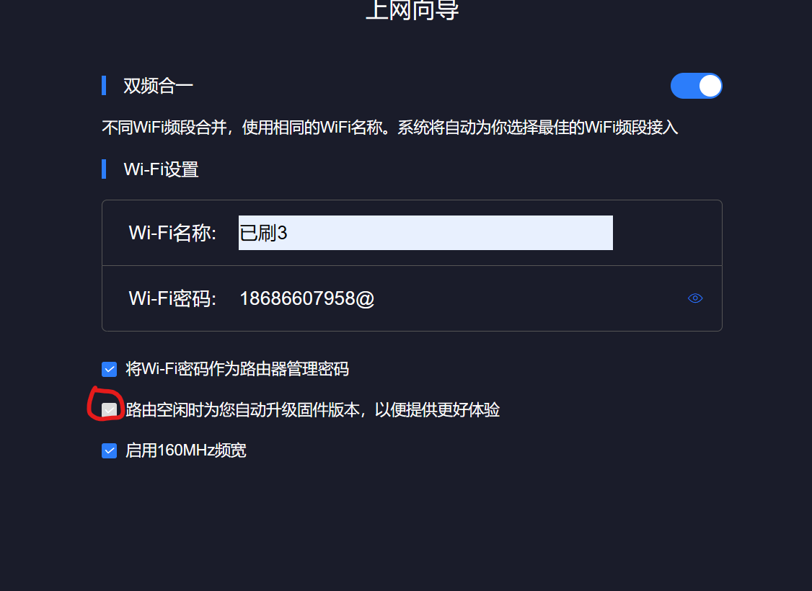

### 在访问```192.168.31.1```
> 小米路由器默认管理界面网址：```192.168.31.1```
获取stok

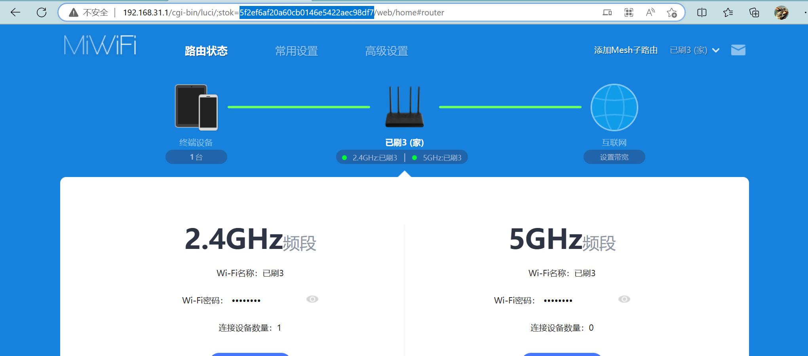

> 每次登录小米路由器后台 stok码 都会变动，请以最新登录的为准。

## 解锁 SSH
### 链接Wi-Fi
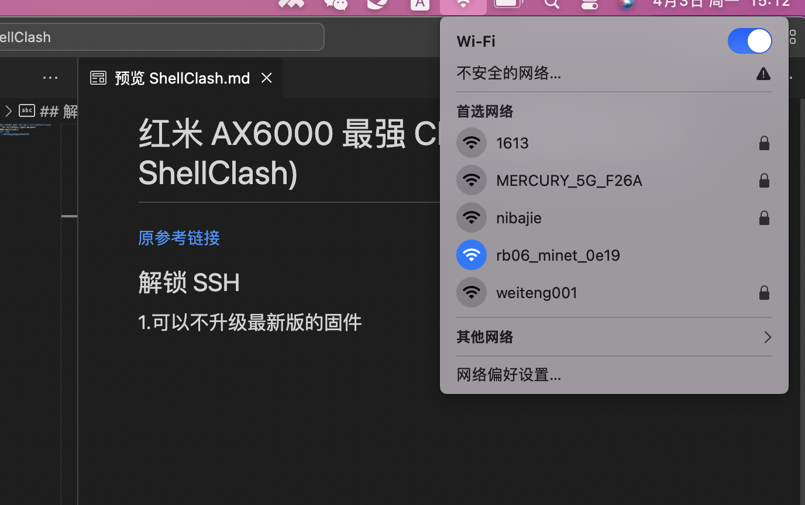

[设置wifi.mp4](set_wifi.mp4)

### 2.可以不升级最新版的固件
### 3.开启调试模式
#### 获取路由器 stock
访问路由器后台```192.168.31.1```
#### 打开浏览器，复制下面的内容到地址栏，并替换 {STOK}
```
http://192.168.31.1/cgi-bin/luci/;stok={token}/api/misystem/set_sys_time?timezone=%20%27%20%3B%20zz%3D%24%28dd%20if%3D%2Fdev%2Fzero%20bs%3D1%20count%3D2%202%3E%2Fdev%2Fnull%29%20%3B%20printf%20%27%A5%5A%25c%25c%27%20%24zz%20%24zz%20%7C%20mtd%20write%20-%20crash%20%3B%20
```
> eg：```http://192.168.31.1/cgi-bin/luci/;stok=bfb7f2bf8f7ec875c2dd440d92ea7837/web/home#router```<br>
> 改成
> ```http://192.168.31.1/cgi-bin/luci/;stok=bfb7f2bf8f7ec875c2dd440d92ea7837/api/misystem/set_sys_time?timezone=%20%27%20%3B%20zz%3D%24%28dd%20if%3D%2Fdev%2Fzero%20bs%3D1%20count%3D2%202%3E%2Fdev%2Fnull%29%20%3B%20printf%20%27%A5%5A%25c%25c%27%20%24zz%20%24zz%20%7C%20mtd%20write%20-%20crash%20%3B%20```
> 
出现下面截图表明成功


### 4.通过浏览器请求重启
同样打开浏览器，复制下面的内容到地址栏，并替换 {STOK}

```
http://192.168.31.1/cgi-bin/luci/;stok={token}/api/misystem/set_sys_time?timezone=%20%27%20%3b%20reboot%20%3b%20
```
> eg：```http://192.168.31.1/cgi-bin/luci/;stok=4a488e412a6b3c924f58feed5f7153b4/web/home#router```<br>
> 改成
> ```http://192.168.31.1/cgi-bin/luci/;stok=bfb7f2bf8f7ec875c2dd440d92ea7837/api/misystem/set_sys_time?timezone=%20%27%20%3b%20reboot%20%3b%20```

出现下面截图表明成功
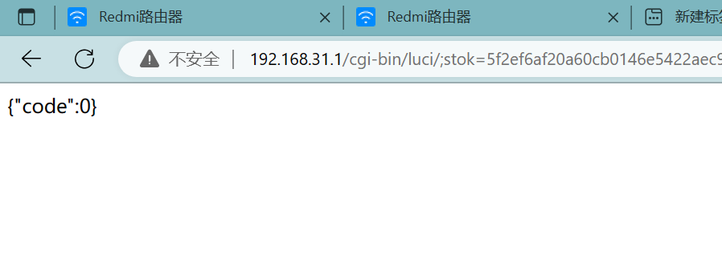

### 5.设置 Bdata 永久开启 telnet
**重启完成后打开路由器后台（注意：路由器重启你需要重新登陆获取下新的 stok ），然后同样打开浏览器，复制下面的内容到地址栏，并替换 {STOK} 。**

```
http://192.168.31.1/cgi-bin/luci/;stok={token}/api/misystem/set_sys_time?timezone=%20%27%20%3B%20bdata%20set%20telnet_en%3D1%20%3B%20bdata%20set%20ssh_en%3D1%20%3B%20bdata%20set%20uart_en%3D1%20%3B%20bdata%20commit%20%3B%20
```
> eg：```http://192.168.31.1/cgi-bin/luci/;stok=4a488e412a6b3c924f58feed5f7153b4/web/home#router```<br>
> 改成
> ```http://192.168.31.1/cgi-bin/luci/;stok=bfb7f2bf8f7ec875c2dd440d92ea7837/api/misystem/set_sys_time?timezone=%20%27%20%3B%20bdata%20set%20telnet_en%3D1%20%3B%20bdata%20set%20ssh_en%3D1%20%3B%20bdata%20set%20uart_en%3D1%20%3B%20bdata%20commit%20%3B%20```

出现下面截图表明成功


### 6.telnet 连接开启 ssh
#### 1)如果是Windows电脑
打开“设置”搜索“控制面板”->“程序”->“程序和功能”->“启用或关闭Windows功能”

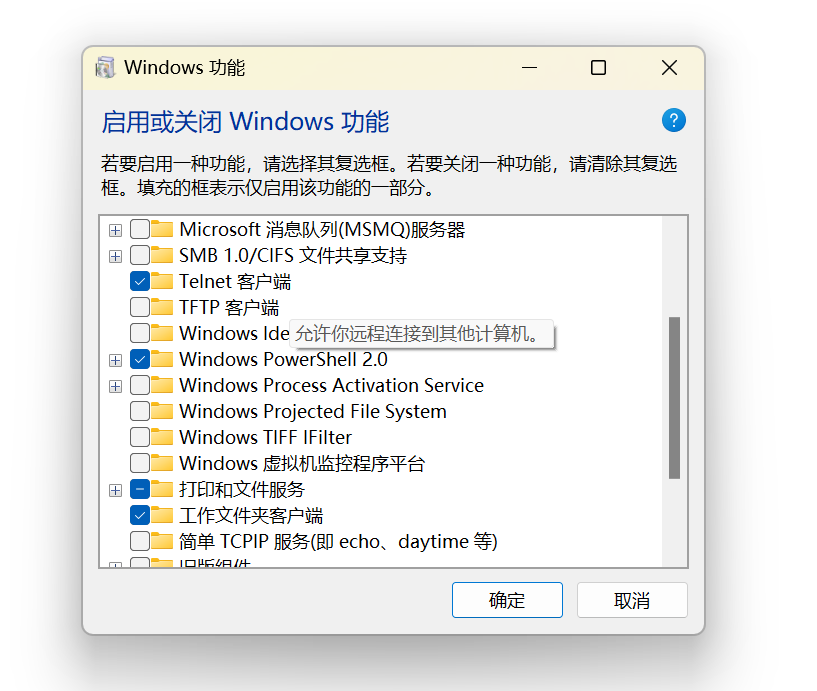

```bash
$> telnet.exe 192.168.31.1
root
admin
```
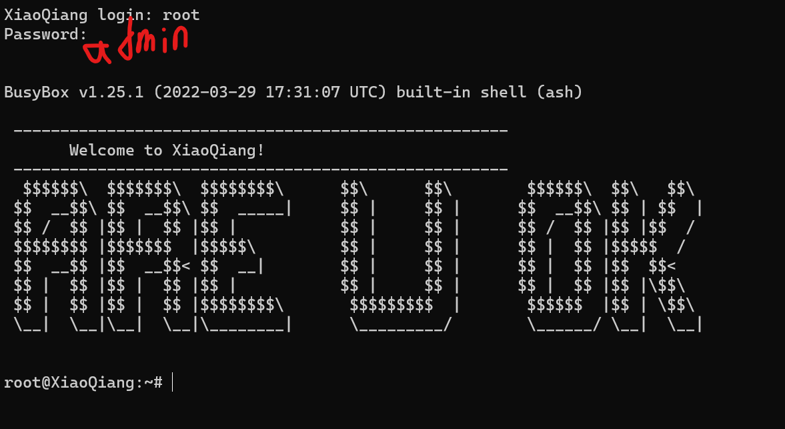
```bash
echo -e 'admin\nadmin' | passwd root
nvram set ssh_en=1
nvram set telnet_en=1
nvram set uart_en=1
nvram set boot_wait=on
nvram commit
sed -i 's/channel=.*/channel="debug"/g' /etc/init.d/dropbear
/etc/init.d/dropbear restart
mkdir /data/auto_ssh
cd /data/auto_ssh
curl -O https://fastly.jsdelivr.net/gh/lemoeo/AX6S@main/auto_ssh.sh
chmod +x auto_ssh.sh
uci set firewall.auto_ssh=include
uci set firewall.auto_ssh.type='script'
uci set firewall.auto_ssh.path='/data/auto_ssh/auto_ssh.sh'
uci set firewall.auto_ssh.enabled='1'
uci commit firewall
uci set system.@system[0].timezone='CST-8'
uci set system.@system[0].webtimezone='CST-8'
uci set system.@system[0].timezoneindex='2.84'
uci commit
mtd erase crash
reboot
```
> 注意：上面的代码意思就是 root密码设置为 ```admin```

## 安装 ShellClash
### Step1
[ShellClash](https://github.com/juewuy/ShellClash/blob/master/README_CN.md)
```
export url='https://raw.fastgit.org/juewuy/ShellClash/master' && sh -c "$(curl -kfsSl $url/install.sh)" && source /etc/profile &> /dev/null
```

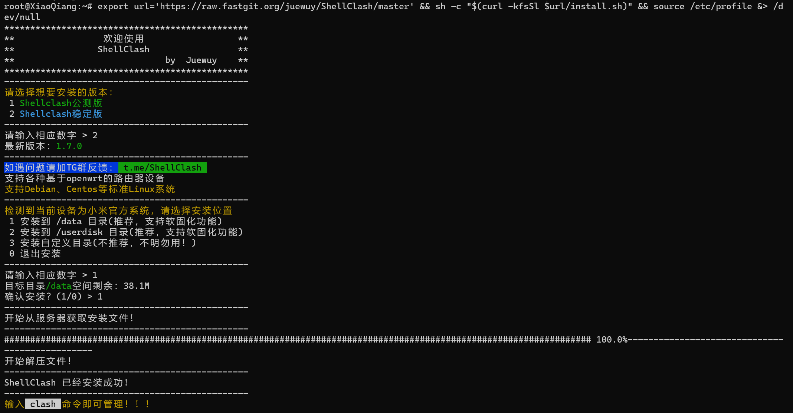

### Step2 scp配置文件
```bash
scp config.yaml root@192.168.31.1:/data/clash
```

###### SCP 传输错误

```bash
 scp -O config.yaml root@192.168.31.1:/data/clash
```


### Step3 升级内核


### 安装成功
访问控制界面
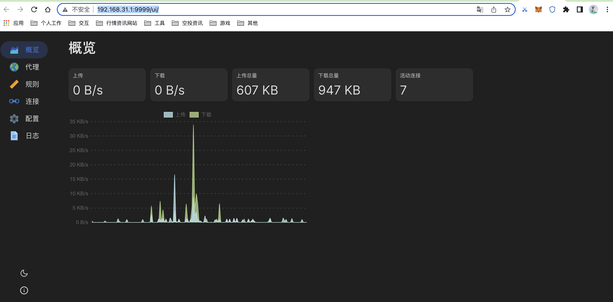

## 常见问题汇总
### 1.ssh访问错误
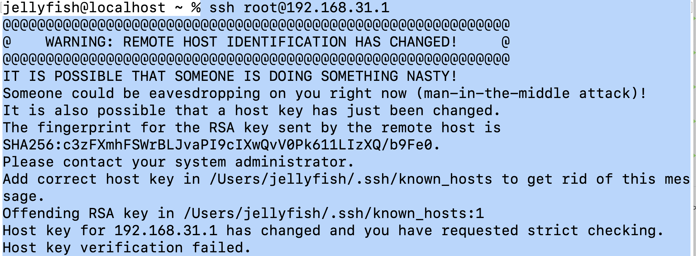
执行```rm /Users/jellyfish/.ssh/known_hosts```

然后在执行
```
ssh root@192.168.31.1
```


---
### Linux下也一样


### 2.Clash服务启动失败！请查看报错信息！
> 目前这个问题只有Mac 系统有这样的问题

再用```scp```重新传输一遍
```
scp config.yaml root@192.168.31.1:/data/clash
```


然后再重新启动一下


[def]: start_telnet.png


# 使用
## 管理界面
管理界面密码

可以设置wifi密码

## 链接方式
### 网线方式
#### 直接插网线就没问题

#### 但有个别路由器插网线也访问不了google，按照如下步骤
##### Step1 windows取消防火墙
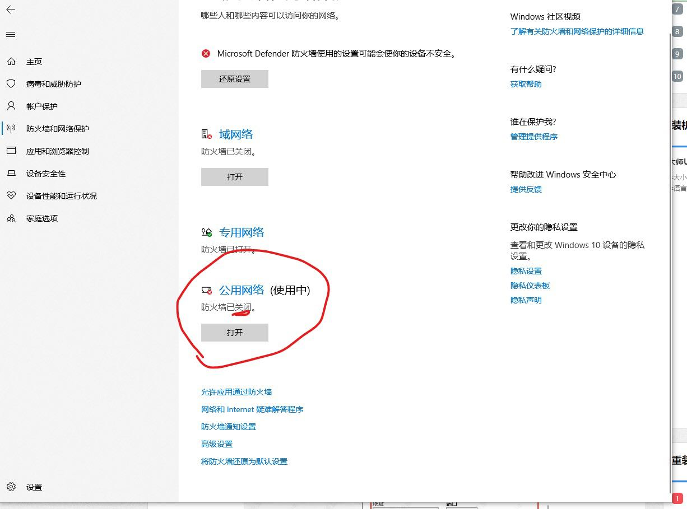
##### Step2 查找路由器ip
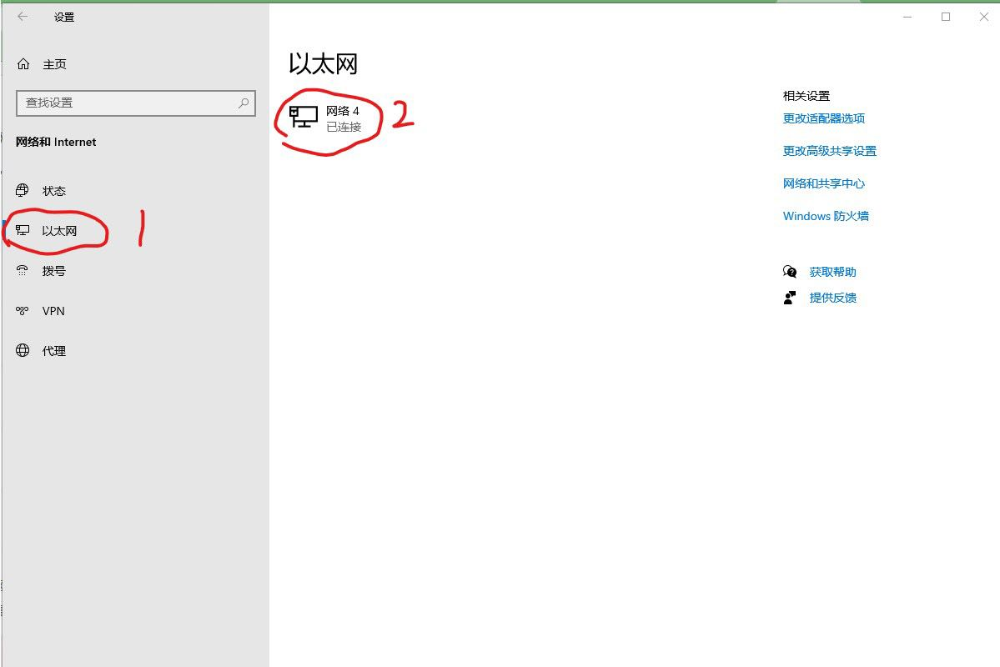
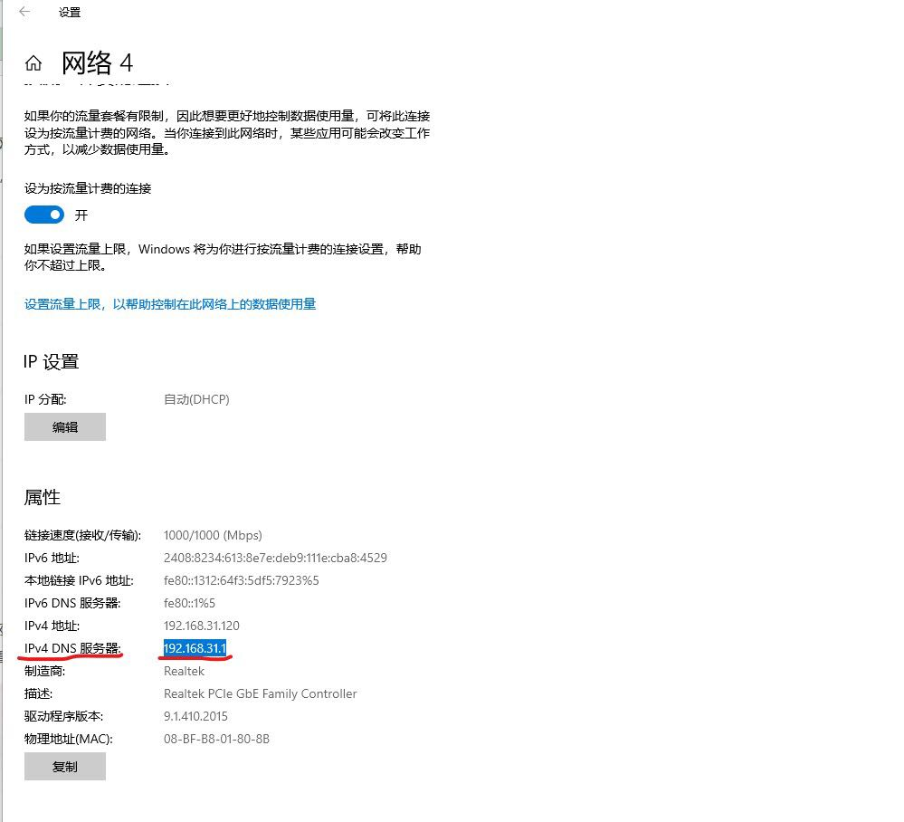
##### Step3 设置代理


### 无线WIFI
#### 直接链接就没问题(路由器自动分配)

#### 如果直接连接有问题——手动设置代理
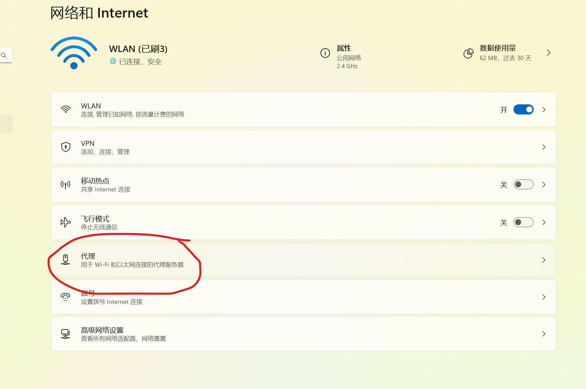
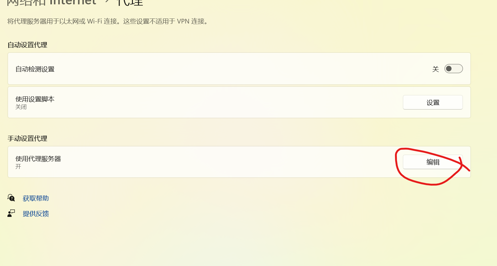

